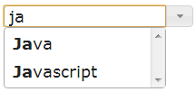
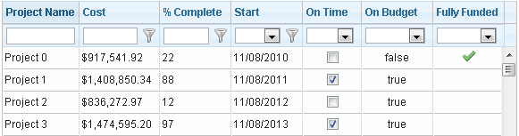
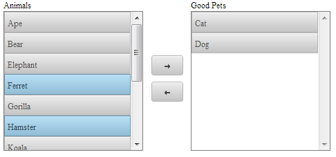
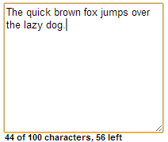

# jquery-ui-plugins
<h3>Overview</h3>
The JQuery UI Plugins project is a collection of UI widgets built using the jQuery UI Widget Factory.

<h3>Getting Help</h3>
If you have questions or issues with a plugin, please post your questions on stackoverflow with the <a href="http://stackoverflow.com/tags/jquery-ui-plugins">jquery-ui-plugins tag</a>.

<h3>Widgets</h3>
<h4>Combobox</h4> A combobox widget that combines a drop-down list with a text field to create a drop-down list that filters options based on the user's input as they type.

<h4>Grid Grid</h4> A jQuery UI based grid widget backed by the extremely scalable <a href="https://github.com/mleibman/SlickGrid">SlickGrid</a>. Features include filtering, sorting and inline editing.

<h4>Groupbox</h4> A groupbox widget for moving items between two lists.

<h4>Text Input</h4> A text input plugin that provides an easy way to selectively suppress character input.

<h4>Textarea</h4> A textarea widget that provides a maximum character length and text selection functionality.

